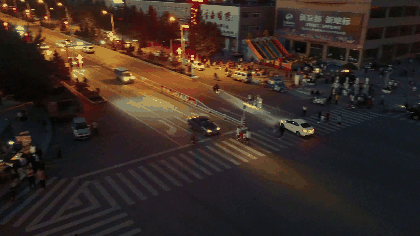
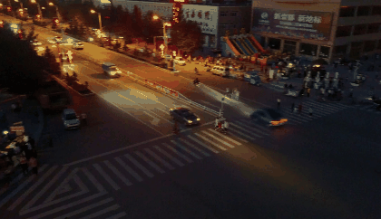

# Aerial Cross-View Box Propagation POC

Does a learned cross-view module beat simple geometry for
tracking a box through camera motion, on ground-level video, and does that result
still hold on aerial drone video?

The core geometry method is training
free and uses no model at all. A later extension tested a pretrained generative video
model (VACE) on top of the geometry.

## Results

Tested the geometric method (background homography propagation) against a no
compensation baseline, on two public aerial datasets (VisDrone-MOT, 7 clips, and UAVDT,
46 clips), over 1,500 tracked objects and hundreds of thousands of frame measurements.

- On clips with real camera motion, the geometric method beat the no compensation
  baseline by roughly 2 to 7 times in tracking accuracy (IoU).
- Center position error dropped from about 136 pixels to about 36 pixels on average.
- The advantage was largest exactly on the clips with the most camera motion, and
  smallest or occasionally negative on very slow or static clips, where compounding
  drift can make the geometric method perform worse than doing nothing over long
  sequences.
- Across the full mix of clips there was no clean line from more camera motion to more
  benefit from geometry. Scene content mattered as much as motion speed.

## Object insertion example

VACE (a pretrained AI video editor) was given a mask following the real,
geometry derived path of a car already driving through this footage, instead of an
arbitrary fixed box, along with a text description of what to draw there.

| Original | Source as VACE saves it | VACE output |
|---|---|---|
|  |  |  |

The middle column is not a byte identical copy of the untouched original: VACE resizes
and renormalizes every input through its own tensor pipeline before saving it, even the
unedited reference copy, which is why it looks visibly different in brightness and color
from the true source frames on the left. Both the middle and right columns went through
that same preprocessing, so the comparison between them is still fair.

Full resolution video files: [untouched original](results/vace_trajectory_result/untouched_original.gif),
[source as VACE saved it](results/vace_trajectory_result/src_video.mp4),
[generated output](results/vace_trajectory_result/out_video.mp4).

The generated video shows a correctly placed, recognizable car following the same path
as the real one in the source. This regenerated a car
that was already present and already masked out, using its real path and a matching
description, rather than inserting a wholly new object into empty space. This is an easier task than true insertion, so this is approach can work.
## Setup 

Python 3.10+ recommended.

```bash
cd aerial_box_propagation
python3 -m venv .venv
source .venv/bin/activate
pip install fiftyone huggingface_hub datasets opencv-python-headless numpy
```

`fiftyone` is imported only for `huggingface_hub`-adjacent tooling during setup; the
actual data path does **not** use FiftyOne's dataset loading, since that requires a
local MongoDB instance that may not be available on every machine. Ground truth is read
directly from the underlying dataset export's `samples.json`.

## Reproducing all results

```bash
cd aerial_box_propagation/src

# 1. Verify camera motion per scene (writes results/motion_probe.json)
python3 motion_probe.py

# 2. Run Protocol A: static-object camera-motion compensation.
#    Downloads and caches VisDrone-MOT frames on first run (data/frames_cache/,
#    ~1-2 GB across all 7 scenes at key-frame stride 5). Writes
#    results/protocol_a_records.json and results/scene_summaries.json.
python3 run_protocol_a.py

# 3. Stratified reporting: motion magnitude, motion type, altitude change,
#    occlusion, horizon, and the drift curve. Writes results/protocol_a_summary.json.
python3 analyze_results.py
```

Everything downloads from Hugging Face (`Voxel51/visdrone-mot`) on first run and is
cached under `data/`; subsequent runs reuse the cache.

## What each module does

- `src/data_loader.py`: parses the dataset's ground truth export directly, bypassing
  FiftyOne and MongoDB. Frame download and caching via `huggingface_hub`.
- `src/geometry.py`: shared affine transform and box math helpers.
- `src/scene_transforms.py`: builds a chained background transform across
  stride-sampled key frames per scene, using ORB features and `estimateAffinePartial2D`.
- `src/static_track_selector.py`: selects tracks whose box motion is well explained by
  the local frame-to-frame background transform, a practical proxy for "this object
  does not move in the world."
- `src/methods.py`: the box-propagation methods compared (static box, homography
  chained, homography direct).
- `src/metrics.py`: IoU, center displacement (pixels and normalized), scale error.
- `src/run_protocol_a.py`: orchestrates the above into per-frame result records.
- `src/analyze_results.py`: stratified aggregation and the drift curve.
- `src/uavdt_data_loader.py`, `src/run_protocol_a_uavdt.py`, `src/analyze_uavdt_results.py`:
  the same pipeline applied to a second, larger dataset (UAVDT) to confirm the result.

## Known gaps

- Only 7 sequences exist in the VisDrone-MOT validation split, fewer than would be
  ideal for strong statistical claims; UAVDT's 46 clips partially address this.
- A learned cross-view baseline was never re-implemented or trained; the comparison
  here is geometry against a no-compensation floor, not against a learned model.
- The static-track selection method and the homography method being evaluated share
  the same underlying model family, which can inflate the apparent advantage of
  geometry. An independent, non-homography-based way of confirming a track is static
  would make this comparison more rigorous.
- A moving-object path propagation protocol (as opposed to static-object tracking) was
  not built.

## Further directions

- Insert a new object (not previously present in the footage) along a real,
  geometry-computed path, as the direct test of true insertion rather than masked
  object regeneration.
- Repeat the object-insertion test on several more real tracked objects to confirm the
  single successful case shown above was not a lucky outcome.
- Compare a dedicated visual-SLAM camera-tracking method against the simple homography
  approach used here, on the same clip, to see whether more precise camera tracking
  meaningfully improves box propagation accuracy.
- Address the static-track selection circularity noted above with an independent
  verification method.
- Try a larger or more capable generative video model to see whether output quality
  improves now that the placement approach is validated.
